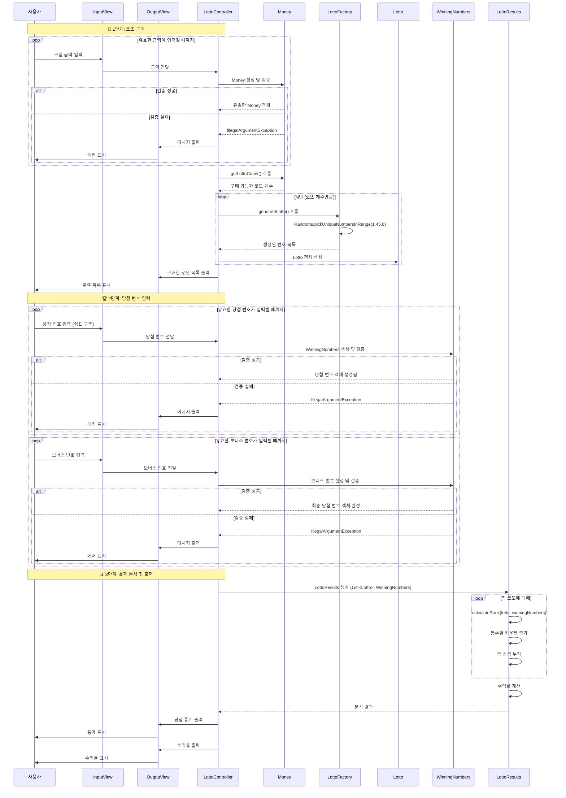

# 🎰 로또 게임 (Lotto Game)

사용자가 입력한 금액만큼 로또를 자동으로 발행하고, 당첨 번호와 보너스 번호를 기준으로 결과 통계와 수익률을 출력하는 콘솔 기반 프로그램입니다.

Java 21 환경에서 동작하며, 기능별 책임을 분리해 구현하는 데 중점을 두었습니다.

 
 

## 🍭 **🎯 프로젝트의 지향점 및** 방향

관련된 데이터와 동작을 함께 묶어 **각 클래스가 분명한 책임을 갖도록 구성**하고, **여러 객체들이 역할에 따라 협력**하며 하나의 기능을 완성할 수 있도록 설계합니다.

TDD 사이클 중 **Inside-Out 방식을 기반으로**, **입출력보다는 먼저 도메인 로직을 중심으로 개발을 시작**하고, 테스트 가능한 작은 단위부터 점차 확장해 나갑니다.

 
 

## 🔁 시퀀스 다이어그램

애플리케이션의 전체 동작 과정과 객체 간의 상호작용을 시각화하기 위해 시퀀스 다이어그램을 사용했습니다.

 
 

## **🧱 객체 역할 요약**

| 객체 이름             | 역할(책임)                                      | 보유 값(상태)                           | 주요 행위                                                                       |
|-------------------|---------------------------------------------|------------------------------------|-----------------------------------------------------------------------------|
| `Money`           | 구입 금액을 표현하고 관련 규칙을 검증하는 값 객체                | * 구입 금액                            | - 금액 유효성 검사, 구매 가능한 로또 수 계산                                                 |
| `Lotto`           | 로또 한 장을 표현하며 번호 규칙(개수, 범위, 중복)의 불변성을 보장     | * 6개의 로또 번호                        | - 번호 정렬 및 중복 검사, 당첨 번호와 일치 개수 계산, 보너스 포함 여부 확인                              |
| `LottoFactory`    | 로또 규칙에 맞는 랜덤 번호를 생성하여 `Lotto` 객체를 만드는 책임을 짐 |                                    | -`Randoms.pickUniqueNumbersInRange()`를 사용해 로또 번호 생성                         |
| `WinningNumbers`  | 당첨 번호와 보너스 번호를 가지며 관련 규칙(개수, 범위, 중복)을 책임짐   | * 6개 당첨 번호, 1개 보너스 번호              | - 당첨 번호 유효성 검사, 보너스 번호 유효성 검사 및 중복 확인                                       |
| `LottoRank`       | 당첨 등수(1~5등, 꽝)의 조건(일치 개수, 보너스)과 상금을 정의      | *Enum class(일치 개수, 보너스 포함여부,당첨 금액) | - 일치 수/보너스 포함 여부로 등수 반환, 상금 반환                                              |
| `LottoResults`    | 전체 당첨 결과를 집계하고 최종 수익률을 계산                   | * 등수별 당첨 횟수, 총 수익률, 누적 상금          | - 각 로또에 대한 등수 계산, 당첨 결과 누적, 수익률 계산                                          |
| `InputView`       | 사용자로부터 입력을 받는 모든 로직을 담당                     | * 입력 접두사                           | - 사용자로부터 입력을 받음, `camp.nextstep.edu.missionutils.Console`의 `readLine()`을 사용 |
| `OutputView`      | 사용자에게 정보를 출력하는 모든 로직을 담당                    | * 출력 접두사                           | - 구매한 로또 목록 출력, 당첨 결과 출력, 수익률 출력                                            |
| `LottoController` | 애플리케이션의 전체 실행 흐름을 조율. View와 Domain 객체들을 연결  |                                    | - 전체 흐름 제어                                                                  |

 
 

## **🚰 구현 순서 (Inside-Out 방식)**

### **1단계: 핵심 도메인 모델 구현**

> 비즈니스의 가장 본질적인 규칙과 데이터를 정의하고 테스트합니다.
>

- `Money`: 금액을 표현하고, 1,000원 단위 검증 및 로또 구매 가능 개수 계산 책임을 가집니다.
- `Lotto`: 로또 한 장(6개 번호)을 표현하며, 번호 개수, 범위, 중복 등 규칙의 불변성을 보장합니다.

### **2단계: 당첨 규칙 및 판정 로직 구현**

> 당첨을 결정하는 기준과 로직을 구현합니다.
>

- `WinningNumbers`: 당첨 번호(6개)와 보너스 번호(1개)를 가지며, 관련된 유효성 검증 책임을 가집니다.
- `LottoRank`: 5개 등수와 '꽝'에 대한 조건(일치 개수, 보너스 여부)과 상금을 `enum`으로 정의합니다. **(등수 판정 로직 포함)**

### **3단계: 결과 집계 및 분석 로직 구현**

> 구매한 로또들의 결과를 종합하여 통계를 내는 책임을 구현합니다.
>

- `LottoResults`: 구매한 모든 `Lotto`와 `WinningNumbers`를 비교하여, 등수별 당첨 횟수를 집계하고 최종 수익률을 계산합니다.

### **4단계: 로또 생성 로직 구현**

> 도메인 규칙에 따라 로또를 생성하는 책임을 구현합니다.
>

- `LottoFactory`: `Randoms` 유틸리티를 사용하여 로또 번호를 생성하고, 검증된 `Lotto` 객체를 생성하여 반환합니다.

### **5단계: 입출력(UI) 계층 구현**

> 사용자와 상호작용하는 부분을 구현합니다.
>

- `InputView`: 사용자로부터 구입 금액, 당첨 번호, 보너스 번호를 입력받는 책임을 가집니다.
- `OutputView`: 구매 내역, 당첨 통계, 수익률, 에러 메시지 등 모든 출력 내용을 형식에 맞게 보여주는 책임을 가집니다.
- `InputValidator`: `InputView`를 통해 들어온 사용자 입력 값의 형식(숫자인지, 쉼표로 구분되는지 등)을 검증합니다.

### **6단계: 애플리케이션 통합 및 실행**

> 구현된 모든 객체를 조립하여 프로그램을 완성합니다.
>

- `LottoController`: 전체 애플리케이션의 실행 흐름(로또 구매 → 당첨 번호 입력 → 결과 발표)을 제어하고, 예외 발생 시 재입력 로직을 처리합니다.
- `Application`: 프로그램의 시작점(`main` 메서드)으로, `LottoController`를 생성하고 실행합니다.

### **7단계: 리팩토링 및 최종 검토**

> 코드 품질을 개선하고 요구사항을 최종 점검합니다.
>

- `ValidationUtil`, `Retry` 등 중복 로직을 유틸리티 클래스로 추출합니다.
- 전체 코드에 대해 프로그래밍 제약 조건(들여쓰기, 메서드 길이 등) 준수 여부를 검토합니다.

 
 

## 📋 예외 처리

사용자의 입력 오류로 예외가 발생하면  **`[ERROR] ...` 로 시작하는 에러 메시지를 사용자에게 출력하고 해당 입력부터 다시 입력을 진행할 수 있도록 합니다.**

예외 처리 메세지는 구현하면서 하나씩 채워 넣을 예정입니다.

| 예외 상황 | 에러 메시지 |
|-------|--------|

## 📋 예외 처리

사용자의 입력 오류로 예외가 발생하면  **`[ERROR] ...` 로 시작하는 에러 메시지를 사용자에게 출력하고 해당 입력부터 다시 입력을 진행할 수 있도록 합니다.**

| 예외 상황                   | 에러 메시지                            |
|-------------------------|-----------------------------------|
| 구입 금액이 0 이하인 경우         | `[ERROR] 구입 금액은 0보다 커야 합니다.`      |
| 구입 금액이 1,000원 단위가 아닌 경우 | `[ERROR] 1,000원 단위로 입력해 주세요.`     |
| 로또 번호가 6개가 아닌 경우        | `[ERROR] 로또 번호는 6개여야 합니다.`        |
| 로또 번호에 중복이 있는 경우        | `[ERROR] 로또 번호는 중복될 수 없습니다.`      |
| 로또 번호가 1~45 범위를 벗어나는 경우 | `[ERROR] 로또 번호는 1부터 45 사이여야 합니다.` |

 
 

## ⚙️ 개발 및 기술 제약

- 이 프로그램은 **Java 21**에서 실행되어야 한다.
- 프로그램의 시작점은 **`Application` 클래스의 `main()`** 메서드여야 한다.
- **제공된 `build.gradle` 파일은 수정할 수 없다.** 외부 라이브러리를 추가하지 않는다.
- 로또 번호 생성은 **`camp.nextstep.edu.missionutils.Randoms.pickUniqueNumbersInRange(1, 45, 6)`** 을 사용한다.
- 사용자 입력은 **`camp.nextstep.edu.missionutils.Console.readLine()`** 으로만 받는다.
- 프로그램 종료를 위해 **`System.exit()`를 호출해서는 안 된다.**
- 들여쓰기는 **2단계 이내**로 유지한다.
- **`else` 문, `switch/case`, 삼항 연산자**는 사용하지 않는다.
- 하나의 메서드는 **한 가지 일만** 하도록 작성하고, **15줄을 넘기지 않도록** 한다.
- 제공된 `Lotto` 클래스에는 **필드를 추가하지 않는다.**

 
 

## 📝 구현 기록 / 고민 정보

구현 과정에서 배우고 고민했던 것들을 기록하는 공간입니다.

- [도메인 설계시 고려했던 것](https://github.com/JohnPrk/java-lotto-8/issues/1)
- **[Inside-Out vs Outside-In TDD 선택 이유](**https://github.com/JohnPrk/java-lotto-8/issues/2**)**
- **[Supplier는 무엇인가?](**https://github.com/JohnPrk/java-lotto-8/issues/3**)**
- **[2023년 구현 vs 지금 구현 비교[회고]](**https://github.com/JohnPrk/java-lotto-8/issues/4**)**

 
 
